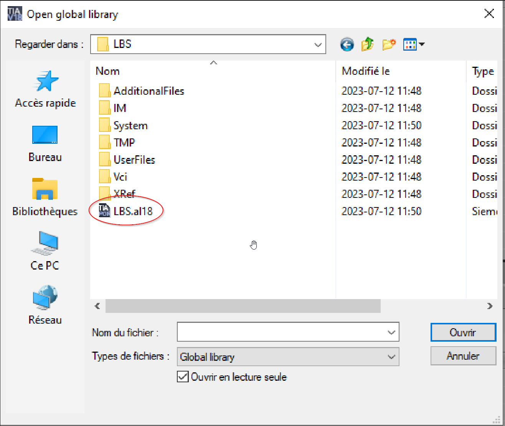

# Installation Guide

This page provides step-by-step instructions on how to install the program.

## Downloading the Program

To begin, download the zip file from GitHub.

[Download Link](https://github.com/Rynstick/LBS)

## Importing the Global Library

After downloading, open your project in TIA Portal. Navigate to the global library and insert a new global library.

Select the appropriate folder (ensure that the zip file has been unzipped) and the library should now appear in the global library.

## Transferring to Local Library

Once the library is in the global library, transfer it to your local library.

## Completion

With these steps, the installation process is complete! For information on how to use the program, refer to the How to Use page.

[How to Use](./HowToUse)
